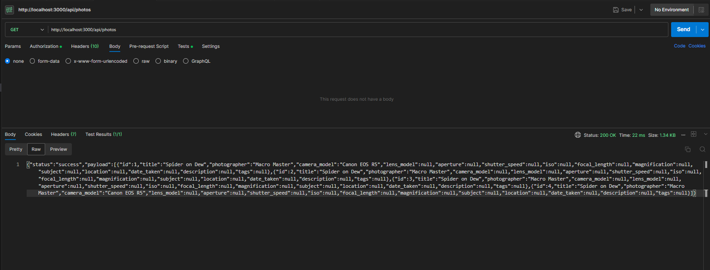
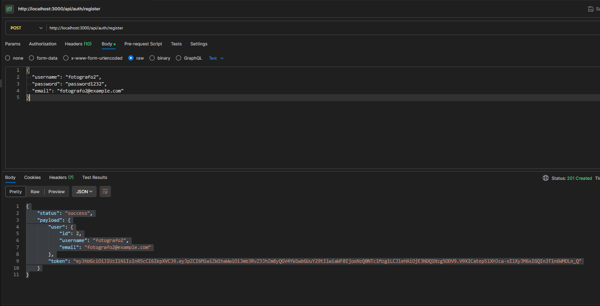
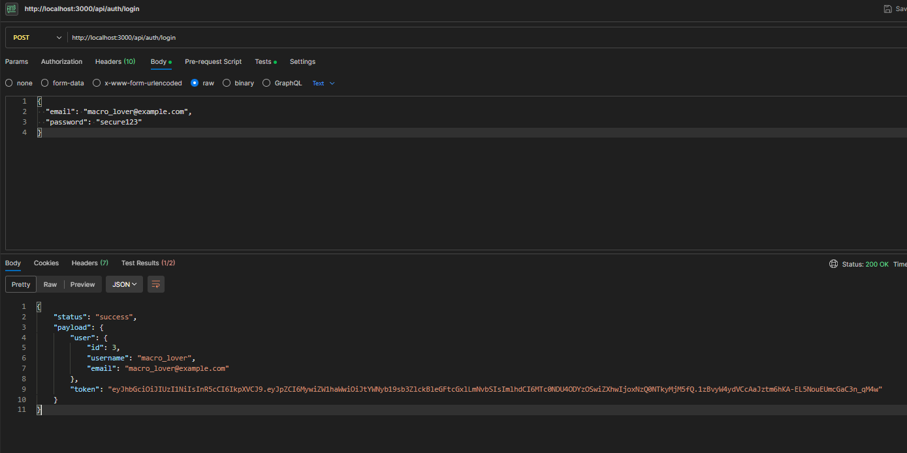
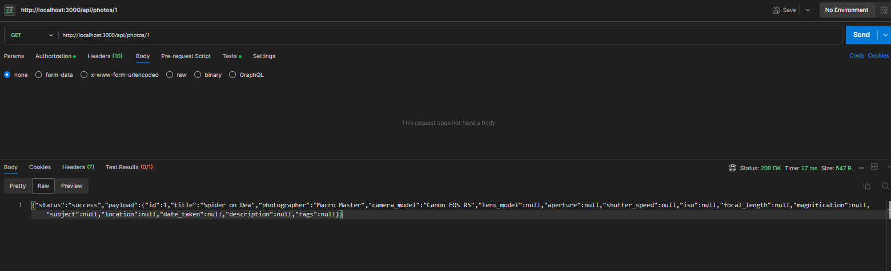
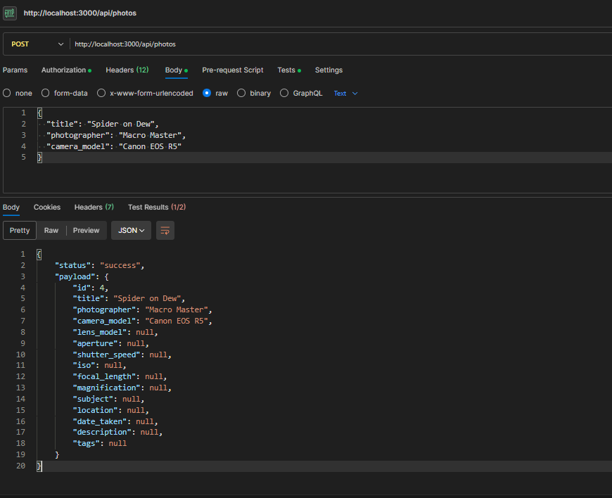
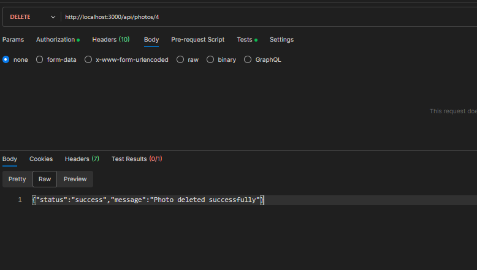
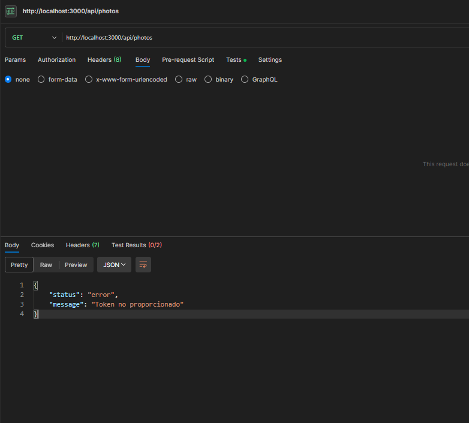
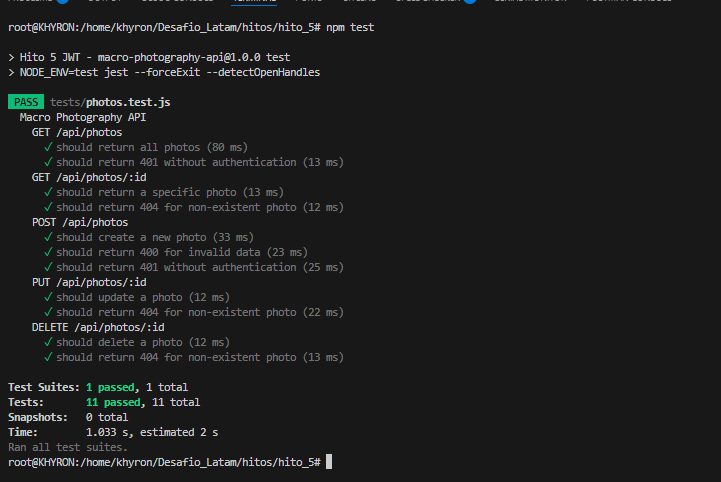

# Macro Photography API Documentation



## Table of Contents
1. [Introduction](#introduction)
2. [API Endpoints](#api-endpoints)
3. [Authentication Flow](#authentication-flow)
4. [Testing Results](#testing-results)
5. [Setup Instructions](#setup-instructions)
6. [Database Schema](#database-schema)
7. [Error Handling](#error-handling)

## Introduction
A RESTful API for managing macro photography metadata with JWT authentication and PostgreSQL backend.

## API Endpoints

### Authentication
- **POST /api/auth/register**  
  Register a new user  
  

- **POST /api/auth/login**  
  Generate JWT token  
  

### Photo Operations
- **GET /api/photos**  
  Get all photos (requires auth)  
  

- **GET /api/photos/:id**  
  Get single photo  
  

- **POST /api/photos**  
  Create new photo  
  

- **PUT /api/photos/:id**  
  Update photo  
  

- **DELETE /api/photos/:id**  
  Delete photo  
  

## Authentication Flow
1. Register user → Get credentials
2. Login with credentials → Receive JWT
3. Include JWT in Authorization header for protected routes

Unauthenticated access attempt:  


## Testing Results

### Automated Test Suite


**Test Coverage:**
- 100% endpoint coverage
- Authentication tests
- CRUD operation tests
- Error case testing

## Setup Instructions

### Requirements
- Node.js 16+
- PostgreSQL 12+
- npm/yarn

### Installation
```bash
# Clone repository
git clone https://github.com/khyron/Desafio_Latam_Hito_5.git
cd Desafio_Latam_Hito_5

# Install dependencies
npm install

# Configure environment
cp env.example .env
# Edit .env with your credentials

# Initialize database
node src/initDB.js

# Start server
npm start
